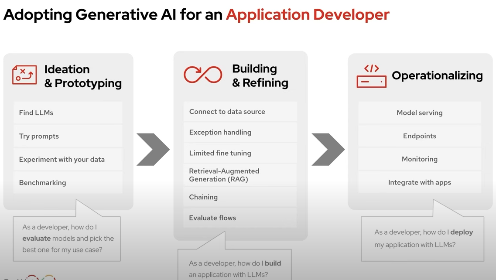
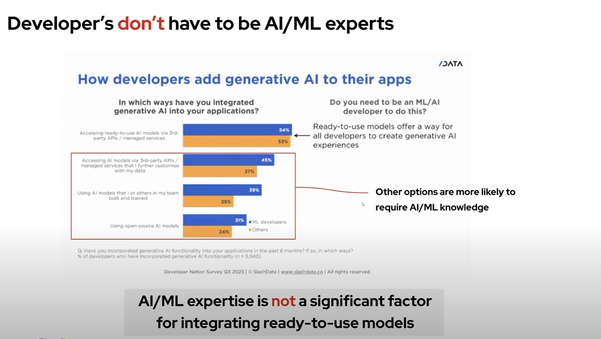
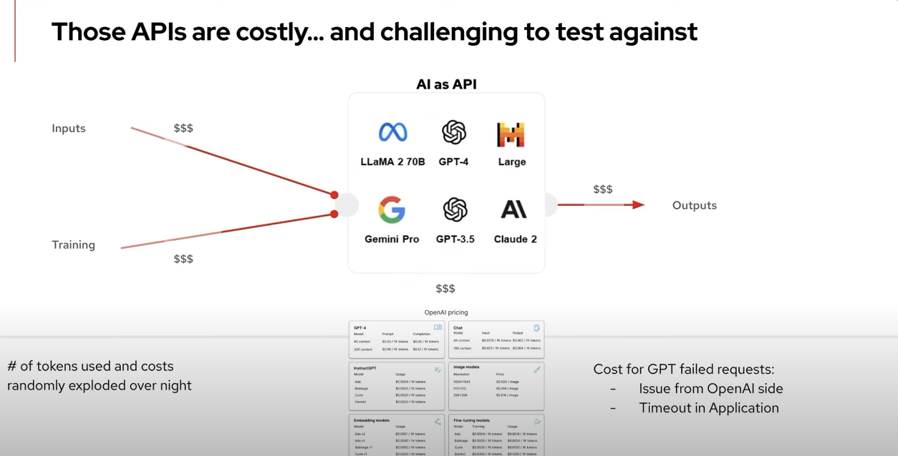
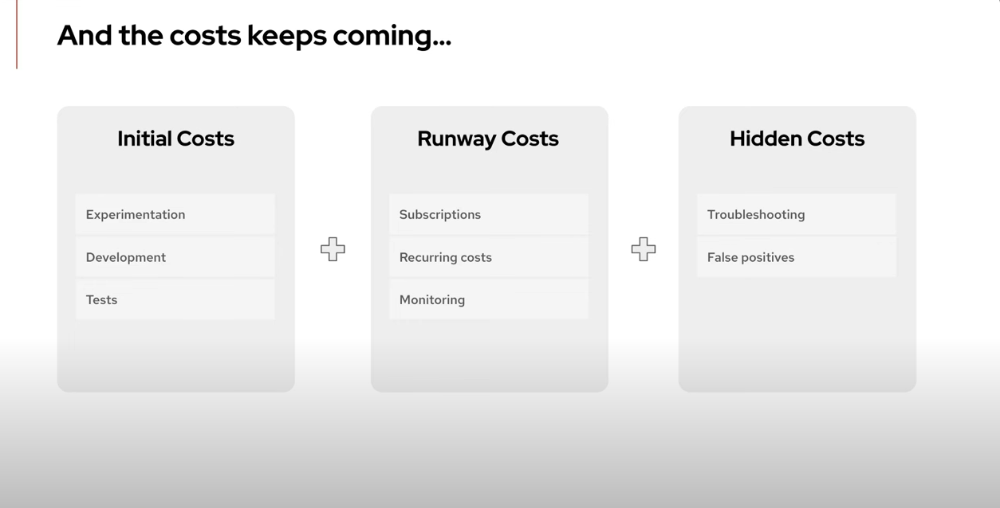
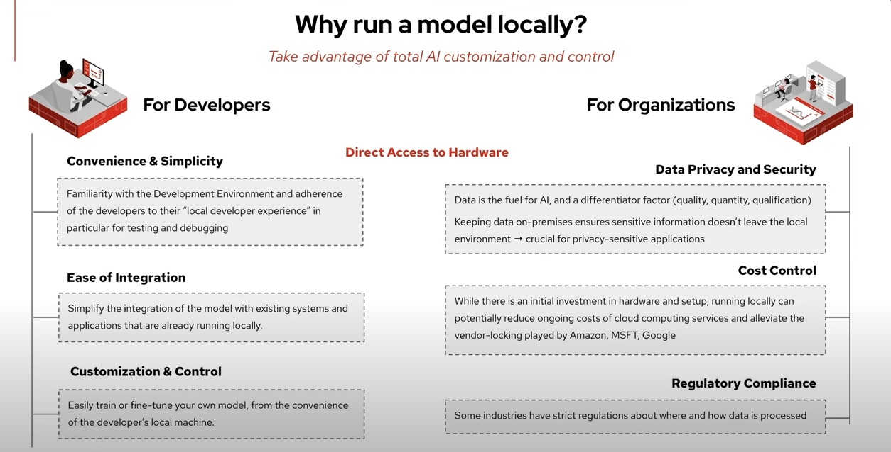

# AI Journey

### Standalone AI

Standalone AI refers to AI frameworks and platforms that can be used independently to build and deploy AI models. These tools often provide a comprehensive set of features for developing AI applications from scratch.

- [Mistral](https://console.mistral.ai/)

- [ChatGPT]

- TensorFlow

Type: Open-source machine learning framework.\
Popularity: Widely used for deep learning and machine learning tasks.\
Open-source: Yes.

- PyTorch

Type: Open-source deep learning framework.\
Popularity: Popular among researchers and developers for its flexibility and ease of use.\
Open-source: Yes.

- IBM Watson

Type: Enterprise AI platform.\
Popularity: Used for various AI applications including natural language processing and data analytics.\
Open-source: No.

### Integrated AI

Integrated AI refers to AI services that are integrated into larger platforms or ecosystems, often provided by cloud service providers. These services are designed to be easily integrated into existing applications and workflows.

- Google AI Services

Type: Integrated AI services including vision, speech, and language processing.\
Popularity: Widely used for integrating AI capabilities into applications.\
Open-source: No.

- Amazon Web Services (AWS) AI

Type: Integrated AI services including machine learning, natural language processing, and computer vision.\
Popularity: Popular for cloud-based AI solutions.\
Open-source: No.

- Microsoft Azure AI

Type: Integrated AI services including cognitive services, machine learning, and bot services.\
Popularity: Used for a variety of AI applications in the cloud.\
Open-source: No.

### Custom AI

Custom AI refers to AI libraries and platforms that allow for the creation of custom AI models tailored to specific needs. These tools often provide flexibility and control over the AI development process.

- Hugging Face Transformers

Type: Open-source library for state-of-the-art Natural Language Processing (NLP).\
Popularity: Widely used for building custom NLP models.\
Open-source: Yes.

- Apache MXNet

Type: Open-source deep learning framework.\
Popularity: Used for building custom deep learning models.\
Open-source: Yes.

- Seldon

Type: Open-source platform for deploying machine learning models.\
Popularity: Used for deploying and managing custom AI models at scale.\
Open-source: Yes.

Note Created: 2025-01-06

