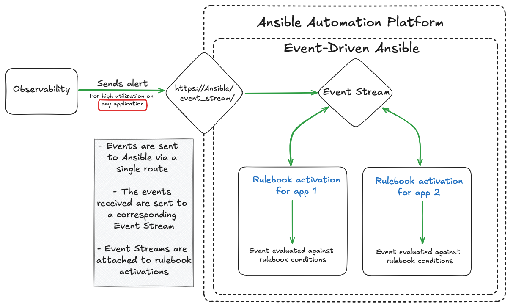

# Event Driven Ansible

## EDA Key Buiding Blocks

- Sources - sources of event data you want to use 
- Rules - What you will create using EDA
- Actions - When a condition or event is met, the Ansible Rulebook executes

## Create **Red Hat Ansible Automation Platform** credential

> Automation Decisions > Infrastructure > Credentials

## Create Project

> Automation Decisions > Projects

## Decision Environments

## Rulebook Activations

Create a Rulebook Activation

> Automation Decisions > Rulebook Activations

## Create some events

Automation and observability

> sudo getenforce example

## Event Streams



### Create **Token Event Stream** credential

> Automation Decisions > Infrastructure > Credentials

### Create **Token Event Stream**

> Automation Decisions > Event Streams
> 
### Add webhook to project

### Create Rulebook activation

> Automation Decisions > Rulebook Activations

> !Note
What we've just done:

1. Created a token based credential that represents a shared secret between Gitea and AAP

2. Created an event stream which creates a simple route for events to be received by AAP

3. Created a Rulebook Activation to listen to the events received on the Event Stream

## Create rule

```yaml
groups:
- name: selinux status
  rules:
  - alert: selinux disabled
    expr: node_selinux_current_mode == 0
    for: 10s
    labels:
      severity: page
    annotations:
      summary: "selinux is disabled on {{ $labels.instance }}"
- name: DiskUsageAlerts
  rules:
    - alert: RootDiskSpaceLow
      expr: node_filesystem_avail_bytes{mountpoint="/"} < (0.2 * node_filesystem_size_bytes{mountpoint="/"})
      for: 10s
      labels:
        severity: warning
      annotations:
        summary: "Low Disk Space Alert on {{ $labels.instance }}"
        description: "Available disk space on {{ $labels.mountpoint }} is below 20%."
```

