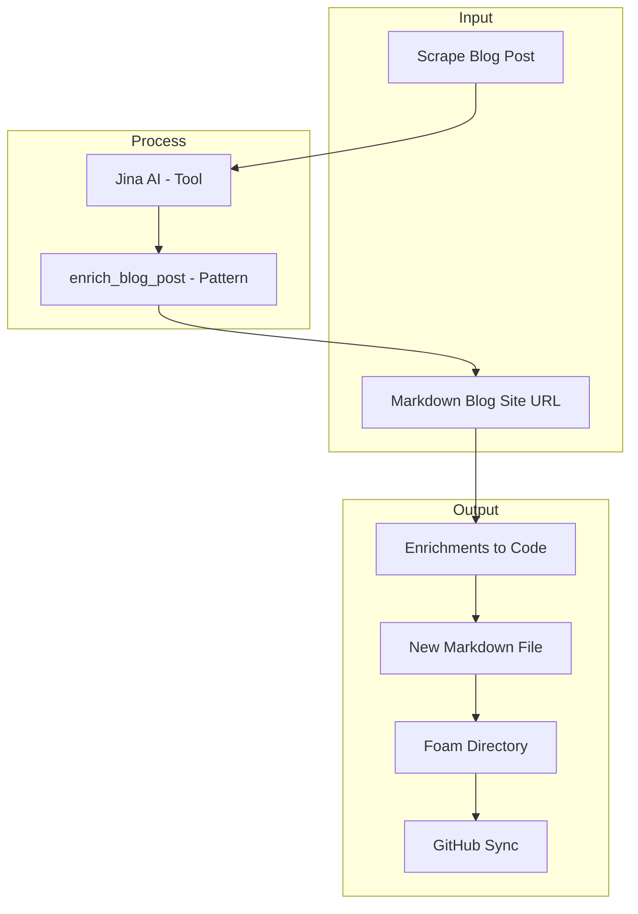

# Fabric Installation and Setup Guide

## Introduction

Fabric is a powerful tool designed to streamline various technical tasks by integrating AI vendors and tools. This guide will walk you through the installation and setup process on a Fedora 41 laptop.

## Installation

### Step 1: Download Fabric

First, download the Fabric binary from the GitHub releases page.

```bash
$ curl -L https://github.com/danielmiessler/fabric/releases/latest/download/fabric-linux-amd64 > fabric && chmod +x fabric && ./fabric --version
```

> **Note:** Ensure that `/home/r3dact3d/bin/` is included in your `$PATH`. You can check your current `$PATH` with:
> ```bash
> $ echo $PATH
> ```
> If not, add it by running:
> ```bash
> $ cd
> $ mkdir bin
> $ mv fabric bin/
> $ fabric --help
> ```

## Setup

### Step 2: Initial Setup

Run the initial setup to configure Fabric.

```bash
$ fabric --setup
```

### Step 3: Configure AI Vendors

Select the AI vendor you want to use. For this example, we'll use Mistral.

```bash
[Plugin Number] Enter the number of the plugin to setup (leave empty to skip): 9
```

Enter your Mistral API key and base URL.

```bash
[Mistral]
Enter your Mistral API KEY (leave empty to skip): "***********************************Uni"
Enter your Mistral API BASE URL (leave empty for 'https://api.mistral.ai/v1' or type 'reset' to remove the value):
```

### Step 4: Configure Tools

Select the default AI vendor and model.

```bash
[Plugin Number] Enter the number of the plugin to setup (leave empty to skip): 10
```

Choose the model you want to use.

```bash
Available models:

Mistral

	[1]	ministral-3b-2410
	[2]	ministral-3b-latest
	[3]	ministral-8b-2410
	[4]	ministral-8b-latest
	[5]	open-mistral-7b
	[6]	mistral-tiny
	[7]	mistral-tiny-2312
	[8]	open-mistral-nemo
	[9]	open-mistral-nemo-2407
	[10]	mistral-tiny-2407
	[11]	mistral-tiny-latest
	[12]	open-mixtral-8x7b
	[13]	mistral-small
	[14]	mistral-small-2312
	[15]	open-mixtral-8x22b
	[16]	open-mixtral-8x22b-2404
	[17]	mistral-small-2402
	[18]	mistral-small-2409
	[19]	mistral-small-latest
	[20]	mistral-medium-2312
	[21]	mistral-medium
	[22]	mistral-medium-latest
	[23]	mistral-large-2402
	[24]	mistral-large-2407
	[25]	mistral-large-2411
	[26]	mistral-large-latest
	[27]	pixtral-large-2411
	[28]	pixtral-large-latest
	[29]	codestral-2405
	[30]	codestral-latest
	[31]	codestral-mamba-2407
	[32]	open-codestral-mamba
	[33]	codestral-mamba-latest
	[34]	pixtral-12b-2409
	[35]	pixtral-12b
	[36]	pixtral-12b-latest
	[37]	mistral-embed
	[38]	mistral-moderation-2411
	[39]	mistral-moderation-latest

[Default]

Enter the index the name of your default model (leave empty to skip): 18
Enter model context length (leave empty to skip):
```

### Step 5: Download Patterns

Finally, download the patterns required for Fabric to function.

```bash
[Plugin Number] Enter the number of the plugin to setup (leave empty to skip): 11
```

Enter the default Git repository URL for the patterns and the folder where they are stored.

```bash
[Patterns Loader]
Enter the default Git repository URL for the patterns (leave empty for 'https://github.com/danielmiessler/fabric.git' or type 'reset' to remove the value):
Enter the default folder in the Git repository where patterns are stored (leave empty for 'patterns' or type 'reset' to remove the value):
```

## Helpers

### Step 6: Install Required Tools

Install the necessary tools and set up clipboard aliases.

```bash
$ sudo dnf install golang-bin
$ go install github.com/danielmiessler/fabric/plugins/tools/to_pdf@latest
$ sudo dnf install -y xclip xsel
```

Add the following aliases to your `.bashrc` file:

```bash
alias pbcopy='xsel --clipboard --input'
alias pbpaste='xclip -selection clipboard -o'
```

## Examples

### Step 7: Run Example Commands

Let's scrape a blog post landing page and see what the `enrich_blog_post` pattern returns.

```bash
fabric -p enrich_blog_post -o /home/r3dact3d/working/foamy-stuff/dump.md -u https://r3dact3d.github.io
```

The output will be saved in a new markdown file in your Foam directory and synced with GitHub.

### Step 8: Chain Patterns

Copy the output to your clipboard with `pbcopy` and use `pbpaste` to feed it into another pattern like `create-mermaid-visualization`.

```bash
pbpaste | fabric -p create-mermaid-visualization
```

The output can be tweaked and added to your workflows for visual notetaking or storytelling.



### More Patterns to Try

- `analyze_logs`
- `create_5_sentence_summary`
- `humanize`
- `create_formal_email`
- `[Uncle Duke](https://github.com/danielmiessler/fabric/blob/main/patterns/ask_uncle_duke/system.md)`

### Pattern Ideas

- [[Bee Keeper]]
- [[Metrics Expert]]
- [[AI chatbot]]
- [[PKM Bot]]
- [[Social Bot]]

### Prompt Prompts

- `summarize_prompt`
- `suggest_pattern`
- `create_pattern`
- `improve_prompt`

[[Pattern Template]]

## Custom Prompts

- [[ask_brad_automation]]
- [[ham_radio_op]]
- [[ham_radio_base]]
- [[net_report]]
- [[write_blog]]
- [[book_plan]]

[//begin]: # "Autogenerated link references for markdown compatibility"
[AI chatbot]: <AI chatbot.md> "AI chatbot"
[PKM Bot]: <PKM Bot.md> "PKM Bot"
[Social Bot]: <Social Bot.md> "Social Bot"
[Pattern Template]: <Pattern Template.md> "Pattern Template"
[ask_brad_automation]: ask_brad_automation.md "ask_brad_automation"
[ham_radio_op]: ham_radio_op.md "ham_radio_op"
[ham_radio_base]: ham_radio_base.md "ham_radio_base"
[net_report]: net_report.md "net_report"
[write_blog]: write_blog.md "write_blog"
[book_plan]: book_plan.md "LIBRIS - Literary Intelligence for Book Recommendations and Insight Synthesis"
[//end]: # "Autogenerated link references"
