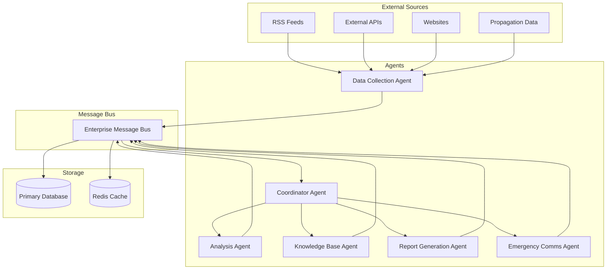

# HAM AI
Let me help you design an AI agent that emulates an experienced Amateur Radio Operator and Elmer. I'll break this down into key components and considerations.

First, let's define the core characteristics of your AI agent:

Core Identity Parameters:
- Amateur Extra Class license privileges indicating comprehensive knowledge of radio operations, regulations, and technical aspects
- Elmer role, suggesting mentoring capabilities and willingness to share knowledge
- Focus on community engagement through nets, contests, and events

Data Processing Requirements:
1. Information Sources
   - ARRL news feeds and bulletins
   - Contest calendars from major organizations
   - Band condition reports and propagation forecasts
   - Emergency communications bulletins
   - Local club activities and announcements

2. Data Categories to Track
   - Upcoming contests and their rules
   - Special event stations
   - DX operations and rare grid squares
   - Technical developments in amateur radio
   - Regulatory updates and changes
   - Emergency communications activities

Let me create a basic template for the Net-style report format:


# Amateur Radio Net Report
**Date**: [Date]
**Time**: [Time] UTC
**Net Control**: [Callsign]
**Band/Mode**: [Frequency/Mode]

## Check-ins
Total Stations: [Number]
[List of callsigns with grid squares]

## Propagation Report
- Solar Flux Index: [SFI]
- A-Index: [A]
- K-Index: [K]
- Band Conditions: [Summary]

## News Items
### Contest Updates
- [Contest Name]
  - Date: [Start/End dates]
  - Bands: [List of bands]
  - Mode: [Operating modes]
  - Exchange: [Required exchange]

### Special Event Stations
- [Callsign]: [Event description]
- Operating times: [Schedule]
- Frequencies: [List of frequencies]

### DX Operations
- [Callsign]: [Location]
- [Operating details]
- [QSL information]

## Technical Discussion
[Topic of the day with technical details]

## Educational Segment
[Elmer's topic of the day with explanations]

## Emergency Communications
- [Current ARES/RACES activities]
- [Emergency net schedules]
- [Training opportunities]

## Upcoming Events
- [List of local/regional/national events]
- [Club meetings]
- [Testing sessions]

## Net Statistics
- Duration: [Time]
- Traffic Handled: [Number of messages]
- Emergency/Priority: [Number]

## Notes
[Additional information or announcements]

73,
[Net Control Callsign]

To implement this AI agent effectively, I recommend the following steps:

1. Data Collection System
   - Develop APIs or RSS feed integrations for major amateur radio news sources
   - Create a database structure to store and categorize information
   - Implement regular updates for propagation data and band conditions

2. Processing Logic
   - Define priority levels for different types of information
   - Create filters for relevant geographic areas
   - Develop algorithms to identify trending topics or emerging patterns

3. Output Generation
   - Implement markdown formatting for consistent reporting
   - Create templates for different types of outputs (daily nets, contest reports, emergency communications)
   - Include automatic UTC time conversion

4. Knowledge Base
   - Build a comprehensive database of amateur radio regulations
   - Include technical references for different operating modes
   - Maintain updated band plans and frequency allocations

## Multi-agent or AI Crew

Separating the system into multiple specialized AI agents would indeed be more efficient and maintainable. Let me outline a proposed multi-agent architecture that would handle different aspects of the amateur radio information system.

Primary Agent Structure:

The Coordinator Agent would serve as the central dispatcher, orchestrating the following specialized agents:

Data Collection Agent
- Focuses exclusively on gathering information from various sources
- Monitors RSS feeds, websites, and APIs for amateur radio news
- Tracks real-time propagation data and band conditions
- Archives historical data for pattern analysis
- Maintains connections with data sources and handles authentication

Analysis Agent
- Processes raw data from the Collection Agent
- Categorizes information based on type (contests, events, emergency)
- Evaluates priority and relevance of information
- Identifies patterns and trends in propagation data
- Generates insights from historical data

Knowledge Base Agent
- Maintains comprehensive amateur radio regulations database
- Updates band plans and frequency allocations
- Stores technical specifications and operating procedures
- Archives educational content for Elmer activities
- Manages geographical and regional information

Report Generation Agent
- Creates formatted reports using markdown templates
- Customizes output based on specific net requirements
- Handles time zone conversions and UTC formatting
- Incorporates proper amateur radio terminology
- Maintains consistent reporting style

Emergency Communications Agent
- Specializes in ARES/RACES information
- Prioritizes emergency-related communications
- Tracks severe weather and potential emergency situations
- Maintains emergency net schedules
- Processes emergency training opportunities

Benefits of this multi-agent approach:

1. Improved Scalability
   - Each agent can be scaled independently based on load
   - New agents can be added without disrupting existing operations

2. Enhanced Reliability
   - Failure in one agent doesn't compromise the entire system
   - Redundancy can be built into critical components

3. Better Maintenance
   - Updates can be applied to individual agents
   - Testing and debugging become more focused

4. Specialized Optimization
   - Each agent can be optimized for its specific task
   - Resource allocation can be tailored to each agent's needs

> Yea, how would we implement at a high-level and how would they interact with each other?

## Multi-agent Architecture - 1st proposal

Let me outline a high-level implementation architecture for our amateur radio multi-agent system, focusing on agent interactions and core functionalities.



Implementation Framework:

The Coordinator Agent serves as the system's orchestrator, implemented using an event-driven architecture. Here's how the system would operate:

1. Data Collection Implementation
The Data Collection Agent operates through multiple microservices:
- An RSS feed processor for news aggregation
- API clients for real-time propagation data
- Web scrapers for specific amateur radio websites
- A scheduler for managing periodic data collection

2. Message Bus Integration
The system utilizes an enterprise message bus (like Apache Kafka or RabbitMQ) to handle inter-agent communication:
- Messages are categorized by topics (news, emergency, contests)
- Priority queues ensure emergency communications take precedence
- Message persistence guarantees delivery even during system interruptions

3. Agent Communication Protocol
Agents communicate using a standardized message format:
```json
{
    "messageId": "unique-identifier",
    "timestamp": "UTC-timestamp",
    "priority": 1-5,
    "type": "news|emergency|contest|propagation",
    "source": "originating-agent",
    "destination": "target-agent",
    "payload": {
        "content": "message-content",
        "metadata": {}
    }
}
```

4. Data Processing Flow
The system processes information through several stages:

First Stage - Data Collection:
- The Data Collection Agent gathers information from external sources
- Raw data is normalized into a standard format
- Initial validation checks are performed

Second Stage - Analysis:
- The Analysis Agent processes normalized data
- Pattern recognition algorithms identify trends
- Priority levels are assigned based on content type

Third Stage - Knowledge Integration:
- The Knowledge Base Agent enriches data with additional context
- Regulatory compliance is verified
- Historical data is correlated with new information

Final Stage - Output Generation:
- The Report Generation Agent creates formatted reports
- Emergency Communications Agent handles priority messages
- Output is tailored based on intended distribution channel

5. Storage Strategy
The system implements a hybrid storage approach:
- Primary Database: PostgreSQL for persistent storage
- Redis Cache: For frequently accessed data
- Time-series Database: For propagation and historical data

6. Error Handling and Recovery
The system includes robust error handling:
- Failed operations are automatically retried
- Circuit breakers prevent cascade failures
- Each agent maintains its own error log
- The Coordinator Agent monitors system health

This architecture allows for:
- Horizontal scaling of individual agents
- Independent deployment and updates
- Real-time processing of emergency communications
- Flexible integration of new data sources
- Reliable delivery of amateur radio information

> Not happy with this proposal due to requiring external components
>
>If I understand the proposed multi-agent architecture, it requires infrastructure components, correct?  How can we accomplish our goal without the need for many external components?

## Multi-agent - Python application

The previous architecture, while comprehensive, requires significant infrastructure overhead. Let me propose a simplified approach that achieves similar goals with minimal external dependencies.

We can implement this as a single Python application that simulates multiple agents through separate classes, each handling specific responsibilities. This approach maintains the separation of concerns while running everything in-process.


```python
from dataclasses import dataclass
from datetime import datetime
from typing import List, Dict, Optional
import feedparser
import json
import logging
from pathlib import Path

@dataclass
class RadioEvent:
    timestamp: datetime
    event_type: str
    title: str
    description: str
    priority: int
    source: str

class DataCollector:
    """Handles data collection from RSS feeds and local files"""
    def __init__(self, feed_urls: List[str], data_directory: Path):
        self.feed_urls = feed_urls
        self.data_directory = data_directory

    def collect_rss_data(self) -> List[RadioEvent]:
        events = []
        for url in self.feed_urls:
            try:
                feed = feedparser.parse(url)
                for entry in feed.entries:
                    events.append(RadioEvent(
                        timestamp=datetime.now(),
                        event_type="news",
                        title=entry.title,
                        description=entry.description,
                        priority=3,
                        source=url
                    ))
            except Exception as e:
                logging.error(f"Error collecting RSS data from {url}: {e}")
        return events

class Analyzer:
    """Processes and categorizes radio events"""
    def analyze_events(self, events: List[RadioEvent]) -> List[RadioEvent]:
        analyzed_events = []
        for event in events:
            # Analyze event content and adjust priority
            if any(keyword in event.description.lower() 
                  for keyword in ['emergency', 'urgent', 'alert']):
                event.priority = 1
            analyzed_events.append(event)
        return analyzed_events

class KnowledgeBase:
    """Maintains amateur radio information and regulations"""
    def __init__(self, data_file: Path):
        self.data_file = data_file
        self.knowledge = self._load_knowledge()

    def _load_knowledge(self) -> Dict:
        try:
            return json.loads(self.data_file.read_text())
        except Exception:
            return {}

    def enrich_event(self, event: RadioEvent) -> RadioEvent:
        # Add relevant knowledge base information to event
        if related_info := self.knowledge.get(event.event_type):
            event.description += f"\n\nRelated Information: {related_info}"
        return event

class ReportGenerator:
    """Generates formatted markdown reports"""
    def generate_report(self, events: List[RadioEvent]) -> str:
        report = ["# Amateur Radio Net Report\n"]
        report.append(f"**Date**: {datetime.now().strftime('%Y-%m-%d')}")
        report.append(f"**Time**: {datetime.now().strftime('%H:%M')} UTC\n")

        # Group events by priority
        priority_events = [e for e in events if e.priority == 1]
        if priority_events:
            report.append("## Emergency Communications")
            for event in priority_events:
                report.append(f"- **{event.title}**\n  {event.description}\n")

        # Add regular events
        report.append("## News and Updates")
        for event in [e for e in events if e.priority > 1]:
            report.append(f"- **{event.title}**\n  {event.description}\n")

        return "\n".join(report)

class HamRadioAgent:
    """Main coordinator class that manages the entire process"""
    def __init__(self, config_file: Path):
        config = json.loads(config_file.read_text())
        self.data_collector = DataCollector(
            config['feed_urls'],
            Path(config['data_directory'])
        )
        self.analyzer = Analyzer()
        self.knowledge_base = KnowledgeBase(Path(config['knowledge_file']))
        self.report_generator = ReportGenerator()

    def process_and_report(self) -> str:
        # Collect data
        events = self.data_collector.collect_rss_data()
        
        # Analyze and prioritize
        events = self.analyzer.analyze_events(events)
        
        # Enrich with knowledge base information
        events = [self.knowledge_base.enrich_event(event) for event in events]
        
        # Generate report
        return self.report_generator.generate_report(events)

def main():
    agent = HamRadioAgent(Path("config.json"))
    report = agent.process_and_report()
    print(report)

if __name__ == "__main__":
    main()

```

This simplified approach offers several advantages:

1. All components run in a single process, eliminating the need for message queues and external databases
2. Data is stored in local files using JSON format, removing database dependencies
3. The system maintains logical separation through classes while keeping everything self-contained
4. Configuration is handled through a simple JSON file

To use this system, you would only need to:
1. Create a config.json file with your RSS feeds and file paths
2. Install Python and the feedparser package
3. Run the script to generate reports

## Containerized Crew

Yes, containerizing this application would make it even easier to run and deploy. Let me provide a Docker implementation that packages everything needed to run the Ham Radio Agent.


```dockerfile
# Dockerfile
FROM python:3.11-slim

WORKDIR /app

# Copy requirements first to leverage Docker cache
COPY requirements.txt .
RUN pip install --no-cache-dir -r requirements.txt

# Copy application code and configuration
COPY ham_radio_agent.py .
COPY config.json .
COPY knowledge_base.json .

# Create data directory
RUN mkdir -p /app/data

# Set up logging
RUN mkdir -p /app/logs

# Run as non-root user for security
RUN useradd -m hamuser
RUN chown -R hamuser:hamuser /app
USER hamuser

# Command to run the agent
CMD ["python", "ham_radio_agent.py"]

# requirements.txt
feedparser==6.0.10
python-dateutil==2.8.2

# config.json
{
    "feed_urls": [
        "http://www.arrl.org/news/rss",
        "http://www.eham.net/articles/rss"
    ],
    "data_directory": "/app/data",
    "knowledge_file": "/app/knowledge_base.json",
    "log_file": "/app/logs/ham_radio_agent.log"
}

# docker-compose.yml
version: '3.8'
services:
  ham-radio-agent:
    build: .
    volumes:
      - ./data:/app/data
      - ./logs:/app/logs
    environment:
      - TZ=UTC
    restart: unless-stopped

```

To use this containerized version, you would follow these simple steps:

1. Create a new directory for your project and save all the files from the artifact.

2. Build and run the container using Docker Compose:
```bash
docker compose up -d
```

This setup provides several advantages:

1. All dependencies are automatically installed within the container
2. The application runs in an isolated environment
3. Data persistence is maintained through volume mounts
4. The container automatically restarts if it crashes
5. Logs are easily accessible in the mounted logs directory

You can retrieve the generated reports by checking the data directory, which is mounted from the container to your local system.

## [[Fabric]] AI framework with [[Mistral]] 

We can simplify this further by using markdown patterns directly with Fabric AI and chaining them using basic shell commands. Let me outline this streamlined approach.

First, let's define our core patterns in separate markdown files:

# ham_radio_base.md

You are an experienced Amateur Radio Extra Class operator and Elmer serving as a Net Control station. Your responses should reflect deep technical knowledge, mentoring capability, and awareness of amateur radio operations, regulations, and best practices. Always use UTC time references and proper amateur radio terminology. Structure all responses in clear markdown format.

# net_report_pattern.md

Based on available amateur radio information, generate a comprehensive net report following this structure:
- UTC timestamp at the top
- Current band conditions and propagation data
- Any emergency or priority traffic
- News and announcements relevant to the amateur radio community
- Technical discussion topic of the day
- Upcoming contests and special events
- Local club activities and testing sessions
Priority should be given to emergency communications and time-sensitive information.

# emergency_pattern.md

Process and format emergency communications with highest priority. Include:
- Clear categorization of urgency level
- Geographic area affected
- Required actions or responses
- Relevant ARES/RACES information
- Net frequencies and schedules
- Emergency point of contact details

# elmer_guidance_pattern.md

Provide technical guidance and mentoring on amateur radio topics. Include:
- Clear explanations of technical concepts
- Practical applications and examples
- References to relevant FCC regulations
- Suggestions for hands-on practice
- Additional learning resources
- Safety considerations where applicable


Now, we can create a simple shell script to orchestrate these patterns:

```bash
#!/bin/bash

# Configuration
FABRIC_PATH="/usr/local/bin/fabric"
PATTERNS_DIR="/opt/ham-radio/patterns"
OUTPUT_DIR="/opt/ham-radio/reports"

# Ensure output directory exists
mkdir -p $OUTPUT_DIR

# Get current UTC timestamp
UTC_TIME=$(date -u +"%Y%m%d_%H%M")

# Function to generate net report
generate_net_report() {
    $FABRIC_PATH process \
        --system-prompt $PATTERNS_DIR/ham_radio_base.md \
        --user-prompt $PATTERNS_DIR/net_report_pattern.md \
        > "$OUTPUT_DIR/net_report_${UTC_TIME}.md"
}

# Function to check emergency traffic
check_emergency() {
    $FABRIC_PATH process \
        --system-prompt $PATTERNS_DIR/ham_radio_base.md \
        --user-prompt $PATTERNS_DIR/emergency_pattern.md \
        > "$OUTPUT_DIR/emergency_${UTC_TIME}.md"
}

# Function to provide Elmer guidance
provide_guidance() {
    $FABRIC_PATH process \
        --system-prompt $PATTERNS_DIR/ham_radio_base.md \
        --user-prompt $PATTERNS_DIR/elmer_guidance_pattern.md \
        --input "$1" \
        > "$OUTPUT_DIR/elmer_guidance_${UTC_TIME}.md"
}

# Main execution
case "$1" in
    "net")
        generate_net_report
        ;;
    "emergency")
        check_emergency
        ;;
    "elmer")
        provide_guidance "$2"
        ;;
    *)
        echo "Usage: $0 {net|emergency|elmer 'question'}"
        exit 1
        ;;
esac

```

To implement this system:

1. Create a directory structure for your patterns and outputs:
```bash
mkdir -p /opt/ham-radio/{patterns,reports}
```

2. Save the patterns from the first artifact to separate files in the patterns directory.

3. Set up a cron job to run regular net reports:
```bash
# Run net report every hour
0 * * * * /opt/ham-radio/ham_radio_agent.sh net

# Check for emergency traffic every 15 minutes
*/15 * * * * /opt/ham-radio/ham_radio_agent.sh emergency
```

You can then use the script in several ways:

For a net report:
```bash
./ham_radio_agent.sh net
```

For emergency traffic:
```bash
./ham_radio_agent.sh emergency
```

For Elmer guidance:
```bash
./ham_radio_agent.sh elmer "How do I calculate coax loss at 440MHz?"
```

This approach offers several advantages:
- Eliminates the need for Python or other programming languages
- Uses simple text files for patterns and configuration
- Leverages standard Unix tools for automation
- Easily modifiable patterns without code changes
- Clear separation of concerns through different pattern files
- Simple to backup and version control
- Can be extended using standard shell scripting


Note Created: 2025-01-08


[//begin]: # "Autogenerated link references for markdown compatibility"
[Fabric]: ../Journeys/Fabric.md "Fabric"
[//end]: # "Autogenerated link references"
