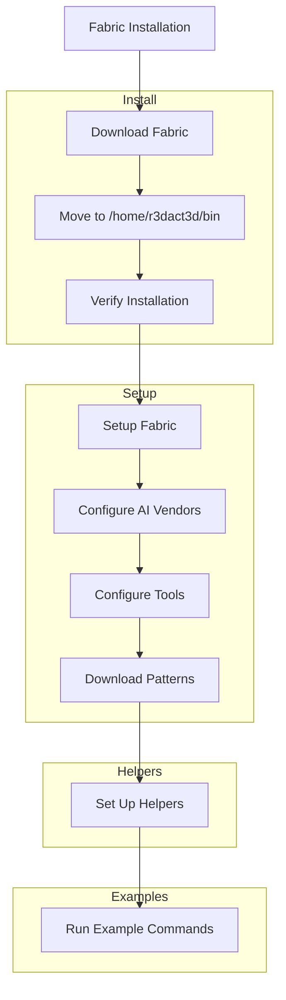
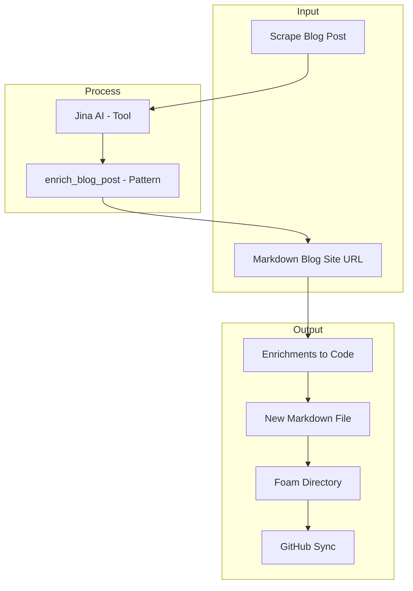

# Fabric



## Install

- [Fabric](https://github.com/danielmiessler/fabric)
  - Install on my **Fedora 41** laptop

```bash
$ curl -L https://github.com/danielmiessler/fabric/releases/latest/download/fabric-linux-amd64 > fabric && chmod +x fabric && ./fabric --version
```
> [!NOTE]
> I already have */home/r3dact3d/bin/* defined in my `$PATH`; so I also moved it there.
> You can also check your path:
> ```bash
> $ echo $PATH
> /home/r3dact3d/.local/bin:/home/r3dact3d/bin:/usr/local/bin:/usr/local/sbin:/usr/bin:/usr/sbin:/var/lib/snapd/snap/bin
> ```
> Move it somewhere already listed
> ```bash
> $ cd
> $ mkdir bin
> $ mv fabric bin/
> $ fabric --help
> ```

## Setup 

```bash
$ fabric --setup

Available plugins (please configure all required plugins)::

AI Vendors [at least one, required]

	[1]	OpenAI
	[2]	Ollama
	[3]	Azure
	[4]	Groq
	[5]	Gemini
	[6]	Anthropic
	[7]	SiliconCloud
	[8]	OpenRouter
	[9]	Mistral

Tools

	[10]	Default AI Vendor and Model [required]
	[11]	Patterns - Downloads patterns [required]
	[12]	YouTube - to grab video transcripts and comments
	[13]	Language - Default AI Vendor Output Language (configured)
	[14]	Jina AI Service - to grab a webpage as clean, LLM-friendly text (configured)

[Plugin Number] Enter the number of the plugin to setup (leave empty to skip):
9

[Mistral]

Enter your Mistral API KEY (leave empty to skip):
"***********************************Uni"

Enter your Mistral API BASE URL (leave empty for 'https://api.mistral.ai/v1' or type 'reset' to remove the value):


Available plugins (please configure all required plugins)::

AI Vendors [at least one, required]

	[1]	OpenAI
	[2]	Ollama
	[3]	Azure
	[4]	Groq
	[5]	Gemini
	[6]	Anthropic
	[7]	SiliconCloud
	[8]	OpenRouter
	[9]	Mistral (configured)

Tools

	[10]	Default AI Vendor and Model [required]
	[11]	Patterns - Downloads patterns [required]
	[12]	YouTube - to grab video transcripts and comments
	[13]	Language - Default AI Vendor Output Language (configured)
	[14]	Jina AI Service - to grab a webpage as clean, LLM-friendly text (configured)

[Plugin Number] Enter the number of the plugin to setup (leave empty to skip):
10

Available models:

Mistral

	[1]	ministral-3b-2410
	[2]	ministral-3b-latest
	[3]	ministral-8b-2410
	[4]	ministral-8b-latest
	[5]	open-mistral-7b
	[6]	mistral-tiny
	[7]	mistral-tiny-2312
	[8]	open-mistral-nemo
	[9]	open-mistral-nemo-2407
	[10]	mistral-tiny-2407
	[11]	mistral-tiny-latest
	[12]	open-mixtral-8x7b
	[13]	mistral-small
	[14]	mistral-small-2312
	[15]	open-mixtral-8x22b
	[16]	open-mixtral-8x22b-2404
	[17]	mistral-small-2402
	[18]	mistral-small-2409
	[19]	mistral-small-latest
	[20]	mistral-medium-2312
	[21]	mistral-medium
	[22]	mistral-medium-latest
	[23]	mistral-large-2402
	[24]	mistral-large-2407
	[25]	mistral-large-2411
	[26]	mistral-large-latest
	[27]	pixtral-large-2411
	[28]	pixtral-large-latest
	[29]	codestral-2405
	[30]	codestral-latest
	[31]	codestral-mamba-2407
	[32]	open-codestral-mamba
	[33]	codestral-mamba-latest
	[34]	pixtral-12b-2409
	[35]	pixtral-12b
	[36]	pixtral-12b-latest
	[37]	mistral-embed
	[38]	mistral-moderation-2411
	[39]	mistral-moderation-latest

[Default]

Enter the index the name of your default model (leave empty to skip):
18

Enter model context length (leave empty to skip):


DEFAULT_VENDOR: Mistral
DEFAULT_MODEL: mistral-small-2409

Available plugins (please configure all required plugins)::

AI Vendors [at least one, required]

	[1]	OpenAI
	[2]	Ollama
	[3]	Azure
	[4]	Groq
	[5]	Gemini
	[6]	Anthropic
	[7]	SiliconCloud
	[8]	OpenRouter
	[9]	Mistral (configured)

Tools

	[10]	Default AI Vendor and Model [required] (configured)
	[11]	Patterns - Downloads patterns [required]
	[12]	YouTube - to grab video transcripts and comments
	[13]	Language - Default AI Vendor Output Language (configured)
	[14]	Jina AI Service - to grab a webpage as clean, LLM-friendly text (configured)

[Plugin Number] Enter the number of the plugin to setup (leave empty to skip):
11

[Patterns Loader]

Enter the default Git repository URL for the patterns (leave empty for 'https://github.com/danielmiessler/fabric.git' or type 'reset' to remove the value):


Enter the default folder in the Git repository where patterns are stored (leave empty for 'patterns' or type 'reset' to remove the value):

Downloading patterns and Populating /home/brthomps/.config/fabric/patterns..
```

## Helpers

I also did the following to get the [pre-reqs](https://github.com/danielmiessler/fabric?tab=readme-ov-file#pbpaste) in place.
```bash
$ sudo dnf install golang-bin
$ go install github.com/danielmiessler/fabric/plugins/tools/to_pdf@latest
$ sudo dnf install -y xclip xsel
```

I also added the below to my **.bashrc** file
```bash
alias pbcopy='xsel --clipboard --input'
alias pbpaste='xclip -selection clipboard -o'
```

## Examples

Let's scrape my blog post landing page at https://r3dact3d.github.io and see what this pattern called **enrich_blog_post** returns from the **Jina AI** integrated tool.  As the pattern name implies, it is designed to take a markdown blog site url and return enrichments to the code. 

> In my example, the output is being saved in a new markdown file in my Foam directory that gets synced with GitHub.

```bash
fabric -p enrich_blog_post -o /home/r3dact3d/working/foamy-stuff/dump.md -u https://r3dact3d.github.io
```

As expected, the output is saved and recognized in my Foam workspace and provides the exact version of my blog landing page with a few enhancements recommended, that ultimately required me to troubleshoot and fix.

In this example, I took the above and copied it to my clipboard with **pbcopy** and now I can use **pbpaste** like below too feed the input into another pattern called **create-mermaid-visualization**,

```bash
pbpaste | fabric -p create-mermaid-visualization 
```

Again, the output ultimately needs to be tweaked, but I can see how this *could* be added to some people's workflows for visual notetaking or storytelling.



```bash
$ cat feedback.md | fabric -sp create_summary
$ cat feedback.md | fabric -sp extract_core_message
$ fabric -p explain_docs -o gw-configure-authentication.md -u https://docs.redhat.com/en/documentation/red_hat_ansible_automation_platform/2.5/html/access_management_and_authentication/gw-configure-authentication
$ cat feedback.md | fabric -sp create_formal_email
```


### More patterns to try

> More power comes when we start to chain these patterns together

- analyze_logs
- create_5_sentence_summary
- humanize
- create_formal_email
- [Uncle Duke](https://github.com/danielmiessler/fabric/blob/main/patterns/ask_uncle_duke/system.md)
  
### Pattern Ideas

- [[Bee Keeper]]
- [[Metrics Expert]]
- [[AI chatbot]]
- [[PKM Bot]]
- [[Social Bot]]


> Tip: you can use the summarize_prompt pattern on any pattern
> ```bash
> $ cd ~/.config/fabric/patterns/
> $ cat summarize_prompt/system.md | fabric -sp summarize_prompt
> ```

### Prompt Prompts

- summarize_prompt
- suggest_pattern
- create_pattern
- improve_prompt

[[Pattern Template]]

[//begin]: # "Autogenerated link references for markdown compatibility"
[AI chatbot]: <../Ideas/AI chatbot.md> "AI chatbot"
[PKM Bot]: <../Ideas/PKM Bot.md> "PKM Bot"
[Social Bot]: <../Ideas/Social Bot.md> "Social Bot"
[//end]: # "Autogenerated link references"
