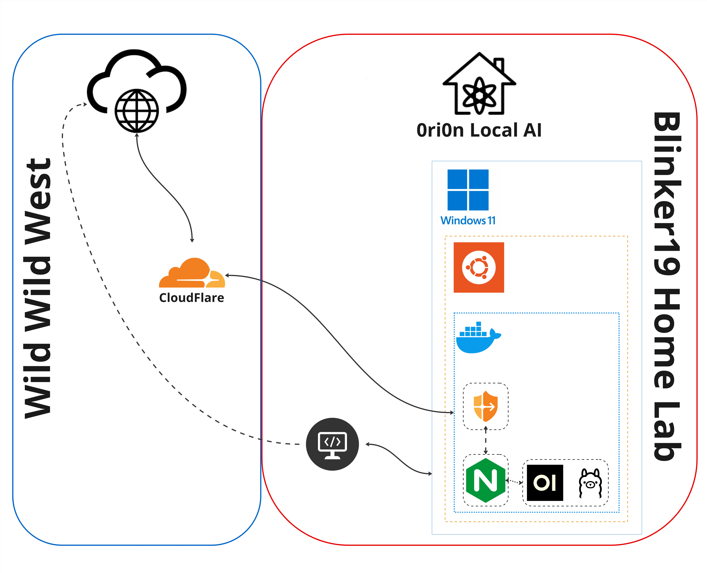

# Home Lab
## Blinker19

> A look at how 0ri0n Local AI is designed at Blinker19 Home Lab

## Purpose

## Hardware

## Software

### [[Docker]]
### [[Ollama]]
### [[Open WebUI]]
### [[Nginx]]
### [[CloudFlare]]

#

[//begin]: # "Autogenerated link references for markdown compatibility"
[Open WebUI]: <../AI/Open WebUI.md> "Open WebUI"
[//end]: # "Autogenerated link references"
