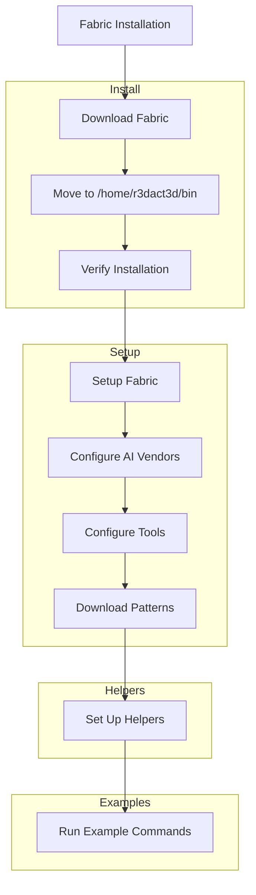

### VISUAL EXPLANATION

- **Fabric Installation**: The process starts with downloading and moving the Fabric binary to the user's bin directory.
- **Setup**: The setup involves configuring AI vendors and tools, including selecting the default model.
- **Helpers**: Additional tools and aliases are set up for helper functions.
- **Examples**: Example commands demonstrate how to use Fabric for enriching blog posts.
